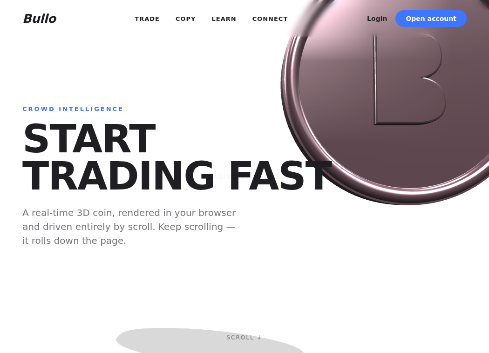
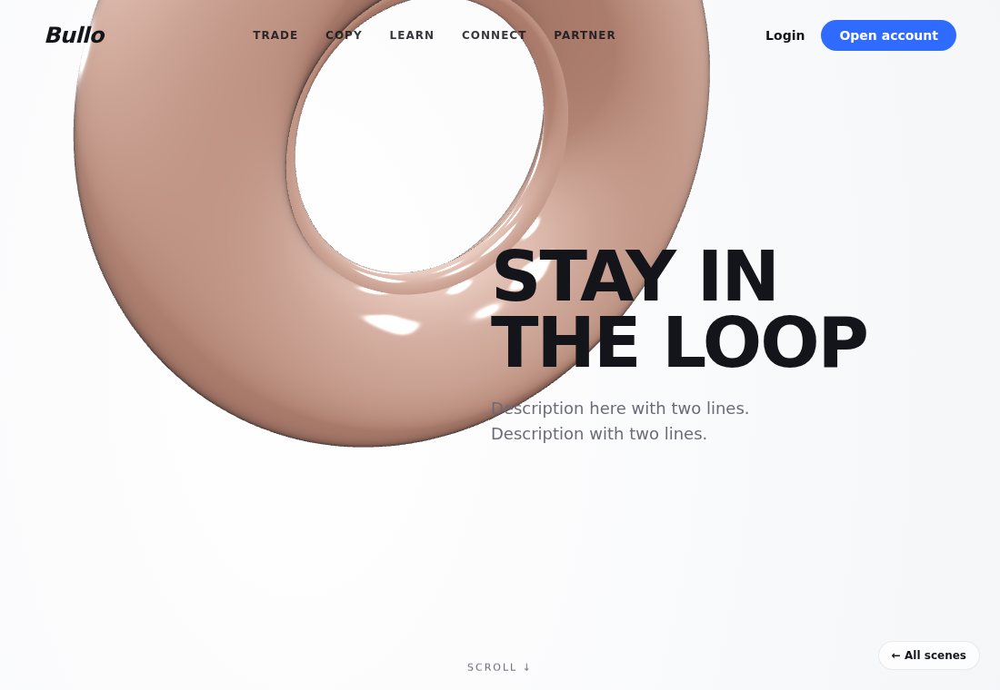
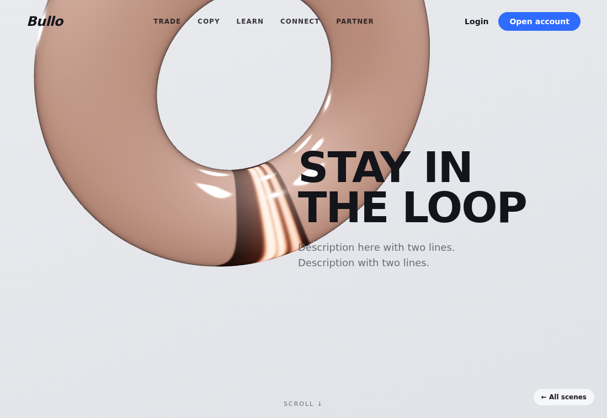

# 3D Scroll-Animation Demos

Self-contained proof-of-concept pages answering: *"can we build sites like these,
with 3D objects that animate as you scroll?"*

**Yes.** Each page renders a live 3D object with [Three.js](https://threejs.org)
and maps its rotation, position, and the camera to scroll progress. No video, no
image sequences — real geometry, real lighting, real glass/metal. Three.js is
**vendored locally** in `vendor/`, so everything runs offline.

Open `gallery.html` to browse them all.

## The scenes

| Page | Reference | Preview |
|---|---|---|
| `index.html` | "START TRADING FAST" — rose-gold coin |  |
| `quantum.html` | EXITO "Quantum Computing in FX Trading" — violet glass coins |  |
| `loop.html` | "STAY IN THE LOOP" — rose-gold glass ring |  |
| `loop-bead.html` | "STAY IN THE LOOP" — ring + ribbed metal bead |  |

## Run it

It's static — serve over `http://` (ES modules won't load from a `file://` URL):

```bash
cd demo-3d-coin
python3 -m http.server 8099
# open http://localhost:8099/gallery.html
```

## How it works

- **`scene-core.js`** — shared Three.js boilerplate: renderer, camera, lights,
  environment reflections, an eased scroll-progress signal, and the render loop.
  Each page imports it, builds its own object(s), and supplies an `update()`
  callback that runs every frame with `progress` (0→1) and pointer position.
- **`shared.css`** — common nav / typography / layout for the pages.
- **`vendor/three/`** — Three.js + `RoomEnvironment`, vendored (no CDN needed).
- Glass objects use `MeshPhysicalMaterial` with `transmission`, `ior`, and
  `thickness`; metal uses `MeshStandardMaterial` with high `metalness`.

## Taking it further

1. **Swap in a designed model** — export a `.glb` from Blender, load it with
   `GLTFLoader`, and drive it with the same scroll logic.
2. **Image-sequence version** — for pixel-perfect agency fidelity, render a frame
   sequence in Blender and scrub through it on scroll (often with GSAP
   ScrollTrigger). Higher fidelity, larger download, not interactive.
3. **Move into the MiroFish Vue app** — the same scene drops into a Vue component
   (`onMounted` to init, `onUnmounted` to dispose), or use
   [TresJS](https://tresjs.org) to express it as Vue components.
