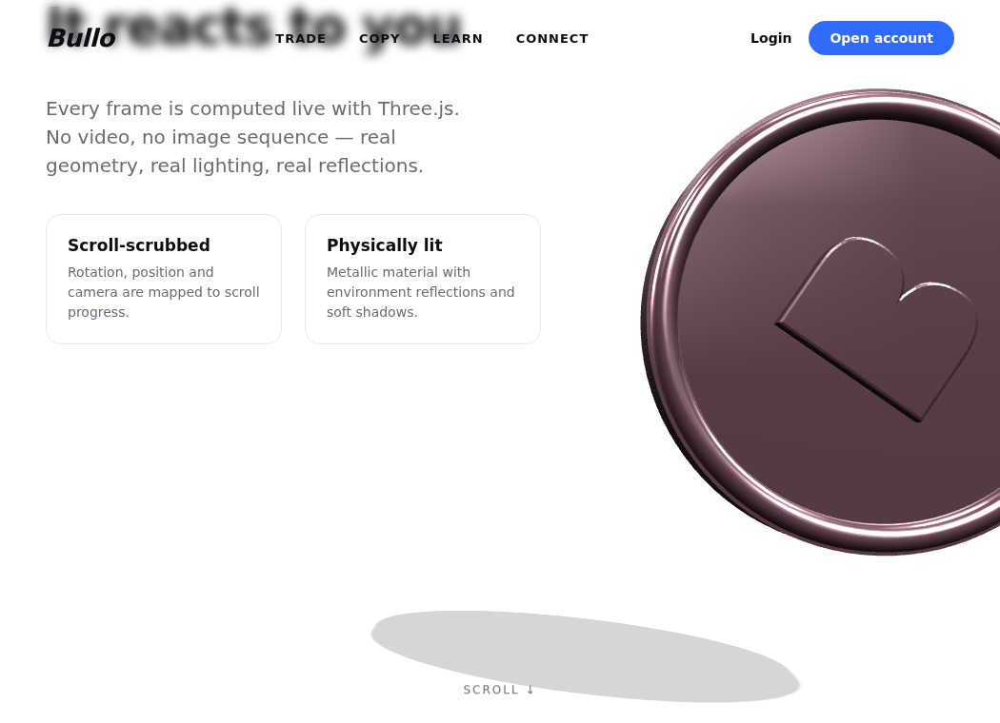

# 3D Rolling Coin — Scroll Demo

A self-contained proof-of-concept answering: *"can we build a site like the Bullo
one, with a 3D coin that rolls down the page as you scroll?"*

**Yes.** This is a single HTML file with a real-time 3D coin rendered by
[Three.js](https://threejs.org). As you scroll, the coin's rotation, position,
and the camera are all mapped to scroll progress — so it tumbles/rolls down the
page. No video, no image sequence: real geometry, real metal, real reflections.

| Top of page | Scrolled (coin rolled down) |
|---|---|
|  |  |

## Run it

It's static — any web server works:

```bash
cd demo-3d-coin
python3 -m http.server 8099
# open http://localhost:8099
```

(Must be served over `http://`, not opened as a `file://` URL, because ES
modules + the import map require it.)

## How it works

- **`index.html`** — markup, styling, and the Three.js scene + scroll logic, all in one file.
- **`vendor/three/`** — Three.js vendored locally (no CDN needed at runtime).
- The coin is built from primitives (cylinder + torus rim + an extruded "B"),
  with a metallic `MeshStandardMaterial` and a `RoomEnvironment` for reflections.
- A `scroll` listener computes `progress` (0→1 down the page); each frame eases
  toward it and drives `coin.rotation.z` (the roll), `coin.position`, and the
  camera. Mouse movement adds subtle parallax.

## Two ways to take this further

1. **Swap in a designed model.** Export a coin (or any object) as `.glb` from
   Blender, load it with `GLTFLoader`, and drive it with the same scroll logic.
2. **Image-sequence version.** For pixel-perfect agency-style fidelity, render a
   frame sequence in Blender and scrub through it on scroll (often paired with
   GSAP ScrollTrigger). Higher visual fidelity, larger download, not interactive.

## Moving it into the MiroFish Vue app

The same scene drops into a Vue component (`onMounted` to init, `onUnmounted` to
dispose). [TresJS](https://tresjs.org) can express the scene as Vue components if
preferred. Ask and I'll wire it into the existing frontend as a route.
