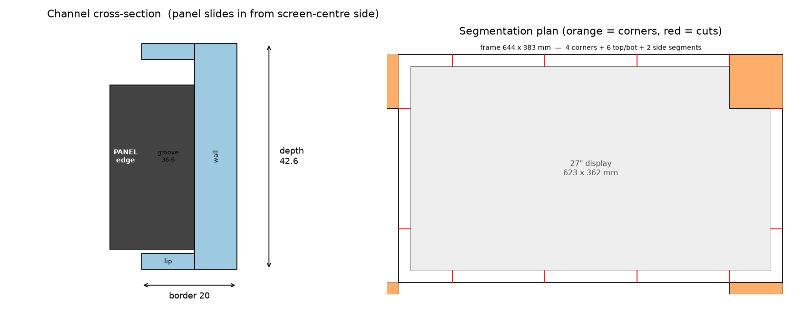

# 27" Display Transport Frame (Rimowa-case conversion)

A 3D-printable **full perimeter frame** that grips the edge of a 27" flat-panel
display so it can travel inside a converted Rimowa (or any) aluminium hard case
— the printable equivalent of the die-cut foam in a [Case Club display shipping
case](https://www.amazon.co.uk/Case-Club-Display-Approved-Shippable/dp/B0BJJ57KHM).

It's a **C-channel "picture frame"**: front + back lips clamp the bezel faces,
and an outer wall takes side/edge impacts. The panel edge sits in a groove that
runs the whole way round.

## Glove-snug fit: rigid shell + compliant liner

A bare hard-plastic groove is **not** glove-snug and never should be — rigid
plastic doesn't conform, and clamping zero-clearance onto glass transmits
transit shock into the bezel. Instead the groove is modelled **oversize by
`liner_thk` (default 2 mm) on every face the panel touches**, and you bond a thin
**self-adhesive EVA foam / flock / TPU liner** into it. The foam compresses for a
glove-tight, non-scratch grip — exactly how the foam-lined Case Club case works,
and it also forgives the display's tapered edge far better than rigid plastic.
Set `liner_thk = 0` for a bare rigid groove.

> ⚠️ The default uses Apple's **published** 31 mm depth, which is the *thickest*
> (centre-hub) point — the real gripped **edge** is thinner and tapered. The foam
> liner absorbs a lot of that, but the truly glove fit comes once you measure the
> actual edge thickness and set `panel_d`. Use a generous/soft foam until then.



## Default target display

Apple **Studio Display 27"** (the only 27" Apple display — the *Pro Display XDR*
is 32"), in its no-stand / VESA form: **623 × 362 × 31 mm**
([Apple specs](https://support.apple.com/en-us/111890)).
If your screen differs, change `panel_w / panel_h / panel_d` (see *Retuning*).

| | mm |
|---|---|
| Frame outer | **644 × 383 × 42.6** |
| Border width (wall 8 + engage 10 + liner 2) | 20 |
| Compliant liner | 2 (foam/flock/TPU in groove) |
| Visible aperture | 604 × 343 |
| Solid volume | ~829 cm³ (~1030 g PLA / ~995 g PETG) |

## ⚠️ Print ONE corner first

This is a **first mockup**. Before committing ~1 kg of filament and a day of
printing, **print `stl/corner_TR.stl` only**, line its groove with your foam/flock
tape, and offer it up to a real corner of your display. Check:

- the lined groove grips the bezel snugly with no rattle and no scratching;
- if it won't seat, drop `liner_thk` 0.5 mm or use softer foam; if it rattles,
  raise `liner_thk` or add a second foam layer;
- the 20 mm border doesn't foul anything on your screen.

Only then print the rest.

## Files

| file | what |
|---|---|
| `frame.scad` | Parametric OpenSCAD source (edit this / export STLs from it) |
| `generate_frame.py` | Python generator — renders every STL with the manifold CSG backend |
| `diagram.py` | Regenerates `frame_overview.png` |
| `stl/` | Ready-to-slice STLs (see cut list below) |

The `.scad` and the `.py` are kept **1:1 in sync** (identical variable names and
geometry). Use whichever you prefer — OpenSCAD for live editing, Python if you
don't have OpenSCAD installed.

## Cut list (default: 220 mm bed)

12 body pieces + alignment pins:

- **4 ×** corner pieces — `corner_TR/TL/BR/BL.stl` (90 × 90 mm legs)
- **6 ×** top/bottom segments — `edge_top_1..3.stl`, `edge_bot_1..3.stl` (~155 mm)
- **2 ×** side segments — `edge_left_1.stl`, `edge_right_1.stl` (~203 mm)
- **~12 ×** `pin.stl` (or cut Ø3 filament / rod to ~17 mm)
- **~2 m** of 2 mm self-adhesive EVA foam / flock tape (~10 mm wide) — the liner

`frame_full_REFERENCE.stl` is the whole ring — **for on-screen preview only, do
not try to print it whole.**

## Printing

- **Material:** PETG or ABS/ASA (impact + heat resistance for a packed case).
  PLA prints easiest but goes soft in a hot car/hold — fine for a test fit.
- **Orientation:** lay each piece flat (the 38.6 mm depth standing up). The pin
  holes then run horizontally — no supports needed.
- **Walls/infill:** 4 perimeters, 30–40 % infill. These are structural.
- **Corners first**, then edges.

## Assembly

1. **Line the groove** of every piece (both lips + back wall) with the
   self-adhesive foam/flock tape *before* joining — this is what makes it snug.
2. Dry-fit all pieces around the display, pins in the Ø3.2 holes between joints.
   The lined groove should grip the bezel with no rattle and no scratching.
3. Check the ring closes square and grips evenly.
4. Bond joints with epoxy or CA (it's a permanent ring) — pins keep faces aligned.
5. Mount the assembled frame into the Rimowa shell. The 8 mm **outer wall** is
   your bonding/strapping surface — glue closed-cell foam to it, or bolt L-tabs
   through the outer wall into the case ribs. (The frame itself only references
   the *screen*; the case-side mounting is the next iteration once you've
   measured your shell's internal depth and rib spacing.)

## Retuning

Everything is driven by the variables at the top of `frame.scad` /
`generate_frame.py`:

- **Different display:** set `panel_w`, `panel_h`, `panel_d`.
- **Glove-snug grip:** `liner_thk` (foam thickness — the main knob); fine-tune the
  hard clearance under it with `clr`, `clr_z`.
- **More protection:** raise `wall` (outer impact wall) and/or `engage` (how far
  the lips wrap the bezel — also deepens the groove).
- **Different printer:** set `bed`; segment counts recompute automatically.

Then:

```bash
pip install trimesh manifold3d numpy-stl matplotlib   # one-time
python3 generate_frame.py     # re-renders stl/ + prints the cut list
python3 diagram.py            # re-renders frame_overview.png
```

or in OpenSCAD: set `part` (`"corner"`, `"edge_top"`, …) and `seg`, press F6,
export STL.

### Measurements to confirm before the final print

- Your display's **exact edge thickness** (`panel_d`) — bezels taper; measure the
  thickest point the frame will clamp. The foam liner forgives a lot, but this is
  what unlocks a true glove fit.
- The Rimowa's **internal depth** — the frame is 42.6 mm deep; the case must close
  over it plus any foam.
